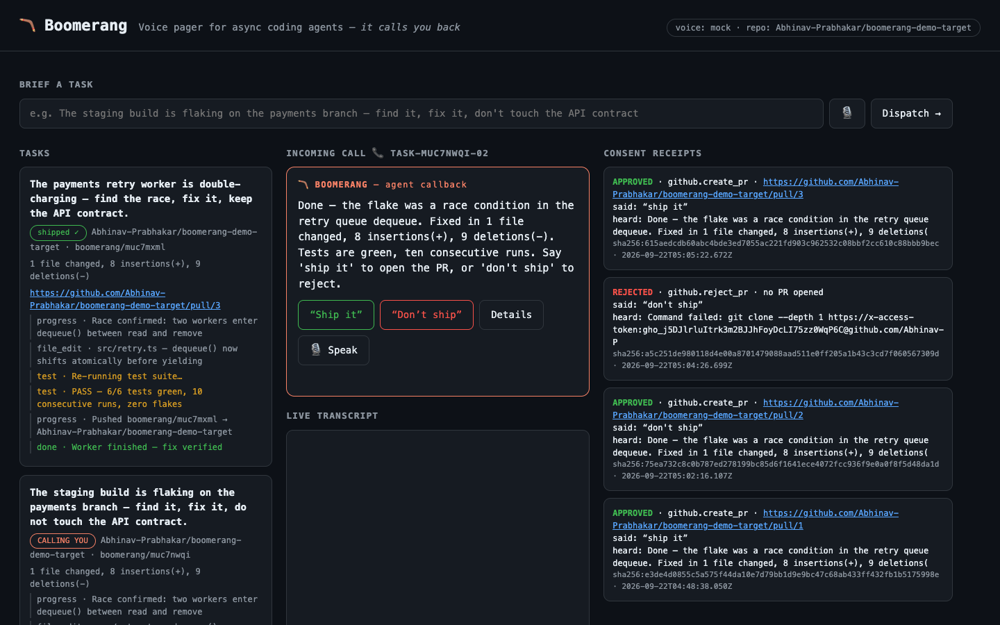
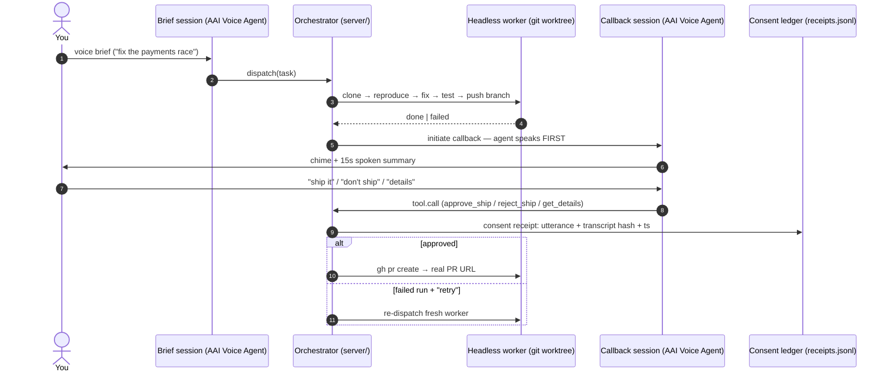

# 🪃 Boomerang

**A voice pager for async coding agents — it calls *you* back.**

Everyone built a voice agent you talk *to*. Ours talks *back* — when the work's done.

Coding agents now run 10–60 minutes unattended, but supervision is still the
bottleneck: a terminal you babysit defeats the point. Boomerang is a two-way
voice bridge:

1. **Brief a coding task by voice**, then walk away.
2. A headless worker does the fix on the target repo.
3. When it finishes (or hits a decision point), **the agent initiates a voice
   callback**: a chime, a 15-second spoken summary —
   *"Done — race condition in `retry.ts`, 42-line diff, tests green.
   Say 'ship it' to open the PR."*
4. It holds for your verbal **go/no-go**, logged as a **consent receipt**
   (spoken utterance + transcript hash + timestamp) before any side effect runs.

Voice becomes an **interrupt channel**, not a chat window.

## Live Demo

**https://crops-could-myth-sent.trycloudflare.com**

> Quick tunnels are ephemeral — if the URL is dead, relaunch in one command:
>
> ```bash
> make demo        # server + cloudflared tunnel; prints a fresh https URL
> ```
>
> Details: [docs/DEMO.md](docs/DEMO.md)



*The moment that makes it a pager: the agent calls you, speaks the summary,
and holds for a verbal go/no-go. The consent receipt lands in the ledger on
the right.*

## Quickstart

```bash
npm install
cp .env.example .env        # add ASSEMBLYAI_API_KEY, or stay on VOICE_PROVIDER=mock
npm run seed                # creates the seeded demo repo with a real flaky-test bug
npm run dev                 # http://localhost:8787
npm run smoke               # end-to-end: brief → worker → callback → "ship it" → PR → receipt
```

Open the dashboard, dispatch the default brief, and watch the worker live-edit
the seeded repo. When it calls back, say **"ship it"** — a real PR opens on the
demo repo, and a consent receipt lands in the ledger. Say **"don't ship"** to
exercise the rejection path. If the worker fails, the callback tells you what
broke and offers **retry or cancel**.

Requirements: Node ≥ 23.6 (native TS type-stripping, zero build step),
`gh` CLI authenticated (for the real git ops + PR), Chrome for mic/STT.

## Architecture

Two orchestrated voice sessions on the AssemblyAI Voice Agent API, with a
consent gate between hearing and doing:



- **Brief session** — user speaks the task. `keyterms` carry repo jargon
  (file names, branch names) so identifiers transcribe correctly.
- **Callback session** — opened *by the server* when the worker finishes or
  fails. The agent speaks first (a real interrupt), then holds the line.
  `tool.call` carries the side effect; every call is gated by a receipt.
- **Consent gate** — `decide()` is the only path to `gh pr create`. No receipt,
  no side effect. Failure callbacks map approval→retry, rejection→cancel.
- **Persistence** — tasks live in `data/tasks.json`; a restart restores
  history and marks interrupted runs honestly instead of dropping them.

Full detail: [docs/architecture.md](docs/architecture.md) ·
AssemblyAI swap-in: [docs/assemblyai-dropin.md](docs/assemblyai-dropin.md)

## Stack

- **AssemblyAI Voice Agent API** (`wss://agents.assemblyai.com/v1/ws`) — two
  orchestrated sessions (brief + callback), `keyterms` for repo jargon,
  JSON-schema `tool.call` carrying the consent-gated side effects, neural turn
  detection tuned for one-word approvals.
- **Node 26 + TypeScript** (native type-stripping, zero build step) — one `ws`
  dependency. Orchestrator, worker, and consent ledger in `server/`; dashboard
  in `web/`.
- **Consent receipts** — append-only JSONL (`data/receipts.jsonl`): every action
  traces to the exact spoken words that authorized it.
- **Seeded demo repo** — a payments retry worker with a genuine check-then-act
  race in `dequeue()` and a flaky exactly-once test (`npm run seed`).

## What's real vs. scripted

- Real: both voice sessions, mic/audio path, git ops (clone → branch → fix →
  test → push → `gh pr create`), consent receipts, dashboard, persistence.
- Scripted today: the worker's *investigation narrative* is a bounded timeline
  (the fix it applies is real and verified by the repo's own test suite). A real
  agent loop drops into `runWorker` in `server/worker.ts`.
- `VOICE_PROVIDER=mock` runs the whole loop with browser STT/TTS — no API key
  needed; swap in `assemblyai` + key for the real sessions.

## Why this wins

| Judging criterion | What Boomerang does about it |
|---|---|
| **Application of Technology** | Uses the Voice Agent API the way it's meant: *two* orchestrated sessions, `keyterms` for jargon, `tool.call` as a consent gate, turn detection tuned for one-word approvals — plus an agent-initiated call, which is the API's least-used superpower. |
| **Presentation** | The demo sells itself in 60 seconds: dispatch → walk away → *phone-call moment* → one spoken word → a real PR + a cryptographic receipt. Live tunnel URL, one-command relaunch (`make demo`), polished dashboard. |
| **Business Value** | Supervision is the last synchronous step in async dev work. PagerDuty proved interrupts beat dashboards for ops; Boomerang is the same pattern for agent output, with consent receipts as a built-in compliance story. |
| **Originality** | Every other entry is a voice agent you talk to. Boomerang is the only pager: the agent initiates, escalates on failure, and refuses to act without your voice on record. |

## Repo hygiene

- `.env` is gitignored — `.env.example` documents every variable.
- `data/` is gitignored: `tasks.json` + `receipts.jsonl` are runtime demo
  artifacts (the audit ledger belongs to the run, not the source). A curated
  receipt snapshot can be committed at submission time if wanted.
- `work/` is gitignored: per-task git worktrees.

## Roadmap

- Real headless coding agent (Claude Code SDK / Aider) behind `runWorker`
- Phone/Slack egress for the callback (it's a pager — it should page anywhere)
- Multi-agent queue: one callback session triaging several workers
- Escalation policies: callback on blocked/failed, not just done *(shipped:
  failure callbacks + retry/cancel are in)*

## License

MIT — built for the [AssemblyAI Voice Agent Hackathon](https://lablab.ai/ai-hackathons/assemblyai-voice-agent-hackathon).
