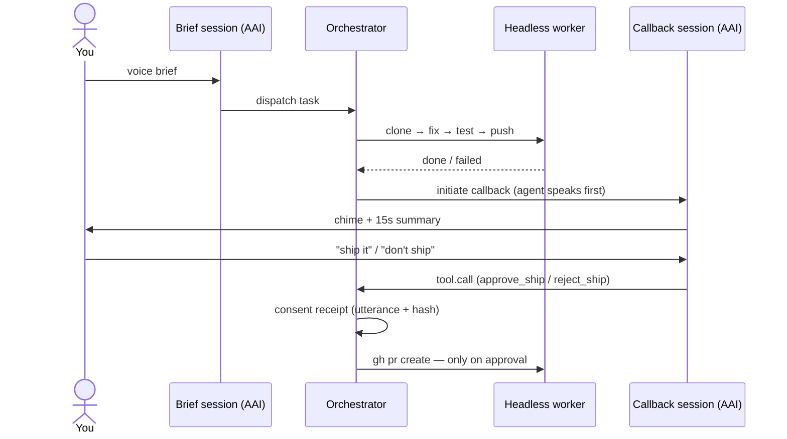

# Boomerang — pitch deck content (~6 slides)

> Slide-by-slide copy for the submission deck. Dark theme, minimal, monospace
> accents. Cover image: `docs/cover.svg`. Screenshots to swap in:
> `docs/screenshot-callback.png` (callback moment), a PR-open shot, a receipt.

---

## Slide 1 — Title

**🪃 BOOMERANG**
*The agent that calls you back.*

A voice pager for async coding agents — built on the AssemblyAI Voice Agent API.

*(visual: cover.svg)*

---

## Slide 2 — Problem

**Agents got async. Supervision didn't.**

- Coding agents now run 10–60 minutes unattended.
- The bottleneck moved: not writing code — *knowing when to look*.
- A terminal you babysit defeats the point. A chat window you poll is worse.
- Every "autonomous" run ends the same way: you checking whether it's done.

**Voice should be an interrupt channel, not a chat window.**

---

## Slide 3 — Demo

**Brief it. Walk away. It calls you.**

1. Speak the brief → a headless worker clones, reproduces, fixes, tests, pushes.
2. When it finishes — or hits a wall — **the agent initiates a voice callback**:
   chime + 15-second spoken summary.
3. It holds for a verbal **go/no-go**. "Ship it" opens a real PR.
4. Every action lands a **consent receipt**: spoken utterance + transcript hash
   + timestamp.

*(visual: screenshot-callback.png — the callback panel holding for consent)*

---

## Slide 4 — Architecture

**Two orchestrated voice sessions, one consent gate.**

- `keyterms` carry repo jargon; `tool.call` carries side effects.
- Turn detection tuned for one-word approvals (`min_silence: 400ms`).
- Failure is a first-class path: the callback says what broke, offers retry.

*(visual: simplified version of docs/architecture.md diagram)*

---

## Slide 5 — AssemblyAI role

**Not a feature — the product.**

- The **callback session** is agent-initiated: the model speaks first, on
  server trigger. That inversion *is* Boomerang.
- `tool.call` = the consent gate: approval is structured, auditable, and the
  only path to a side effect.
- `keyterms` keep `retry.ts`, branch names, and repo jargon intact in speech.
- Neural turn detection holds the line open through a human's "uhh… ship it."

---

## Slide 6 — Business value

**Supervision is the last synchronous step in async dev work.**

- PagerDuty showed interrupts beat dashboards for ops. Boomerang is the same
  pattern for agent output: reach the human where they are, only when needed.
- Consent receipts = compliance story for agent-driven side effects
  (SOC 2-style auditability from day one).
- Extends anywhere paging matters: PR review queues, deploy approvals,
  multi-agent triage, phone/Slack egress.

**Boomerang: throw the task, it comes back with an answer.**

*(visual: receipt close-up — utterance → sha256 → PR URL)*
